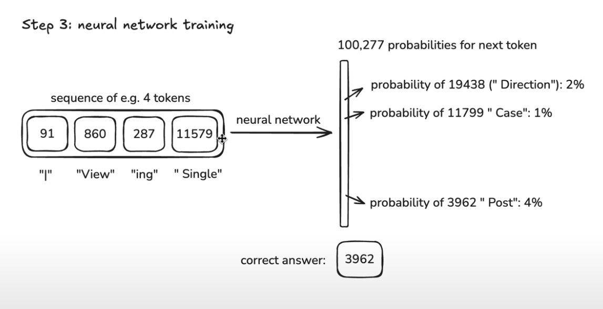
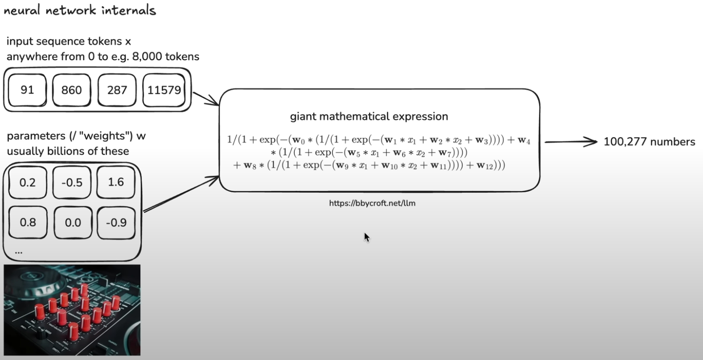
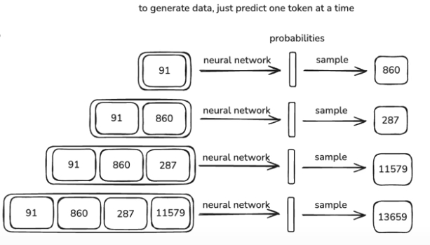
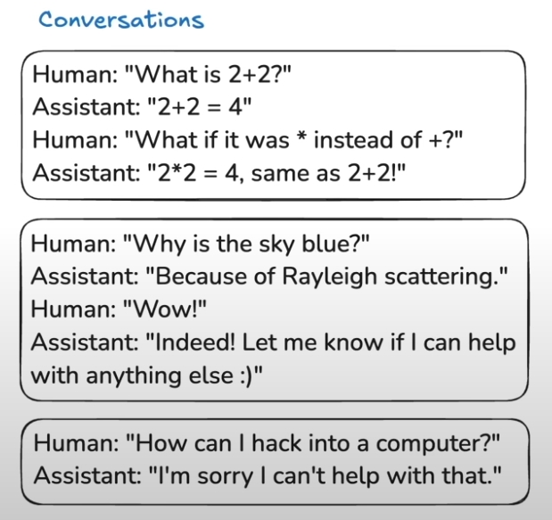

## Introduction

当你在 ChatGPT 的对话框中输入信息，并且点击 “Send” 按钮后，得到了 ChatGPT 的回答。

这个充满着神奇的工具背后的原理究竟是什么呢？

越来越多的人类将接触知识的媒介从搜索引擎的 Input text 转换到了聊天工具的 Input Text，并且这个趋势还在持续增长。

但是在这个对话框中，你应该输入什么，AI给你的回答又是如何生成的？

希望通过这篇文章，你能了解 ChatGPT 背后的概念和原理，以及这样的工具是通过何种方式构建的。

并且你能知道这类工具究竟擅长什么领域，又不适合哪些任务，认识到这类工具在哪些特别情况可能成为双刃剑。

最后对AI的理解能有一个自己的独特认识。

*文章内容根据 Andrej Karpathy 的视频[Deep dive into LLMs like ChatGPT](https://www.youtube.com/watch?v=7xTGNNLPyMI) 进行整理。*

## How to build a ChatGPT

构建一个 Chat GPT 是一个按固定顺序的多步骤过程，下面是这些步骤的简要介绍。

## 1. Pre-training

预训练的第一个步骤是下载并处理大量的互联网文本数据。

### 1.1 Download and process Internet

为了大致了解这个步骤是怎么做，可以从huggingface的 [FineWeb](https://huggingface.co/spaces/HuggingFaceFW/blogpost-fineweb-v1)开始。

[FineWeb](https://huggingface.co/spaces/HuggingFaceFW/blogpost-fineweb-v1)的首页介绍了这个项目的整体情况，以及它是如何构建的。

所有主流的大语言模型如 ChatGPT,Llama,Claude 的母公司 OpenAI,Anthropic,Meta，它们内部都有一个类似的数据集。

所以，概括的说，这个步骤是想要取得什么样的目标？

**大量的文本**，从公开领域搜集非常多非常多高质量的文本，同时，我们希望这些文本内容是极具多样性的，因为我们希望内部包含了很多方面的知识。

FineWeb 是一个我们可以接触到的生产级别就绪的数据集的典型示例。

> a new, large-scale (15-trillion tokens, 44TB disk space) dataset for LLM pretraining.

但是以今天的互联网数据来说，这实际上并不是一个非常大的数据集。

FineWeb 并不是一个从0开始的项目，它起源于 [Common crawl](https://commoncrawl.org/)

> The Common Crawl non–profit organization has been crawling the web since 2007 and releases a new crawl containing 200 to 400 TiB of textual content obtained via automatic web crawling usually every 1 or 2 months.

可以看到截至到2024年，Common crawl 相关的网页搜索数据。

> the latest CC crawl (April 2024) contains 2.7 billion web pages, totaling 386 TiB of uncompressed HTML text content.

爬虫的工作方式：

> crawlers start with a few seed web pages and then follow links to other pages. 

Common crawl搜集的数据其实相对比较原始，要想成为一个大模型预训练的数据集，还需要进行很多处理。

> The Common Crawl dataset is a collection of web pages that are publicly available on the internet. It contains a large amount of textual data, but it is not always clean and well-structured.

构建像FineWeb这样的大型数据集实际是一个具有相当复杂程度的任务，需要从互联网中获取大量的文本并妥善处理多个步骤。

The FineWeb pipeline


1. URL Filtering: 使用 [blocklist](https://dsi.ut-capitole.fr/blacklists/)过滤掉那些不适合作为训练数据集的网页(例如暴力，歧视等网站)。
2. Text Extraction: 从网页中提取文本(原始的网页为 HTML 格式，可能还包含了 CSS，JavaScript 等代码，需要进行纯文本提取)。
3. Language Filtering: 使用 [fastText language classifier](https://fasttext.cc/docs/en/language-identification.html) 提取英语为主的文本。

    > The hottest new programming language is English.
    > --- [Andrej Karpathy](https://x.com/karpathy/status/1617979122625712128)

4. Gopher Filtering: Gopher 过滤器。
5. MinHash Filtering: 过滤掉那些相似的网页。
6. C4 Filters: C4 过滤器。
7. Custom Filters: 自定义过滤器，比如，过滤掉那些包含特定词汇的网页。
8. PⅡ Filtering: 删除可识别个人身份的信息 ID Card。

[Final dataset](https://huggingface.co/datasets/HuggingFaceFW/fineweb) looks like

神经网络的输入的就是这个数据集中所有 text 的序列。

最终的目标是学习 text 之间的 patterns，并生成符合语言规律的文本。

### 1.2 Tokenization

在将这些文本 Plug into Neural Networks 之前，我们需要对文本做一些转换工作，文本该如何被表示？

神经网络需要的是一维数字序列，所以如何将文本转换为数字序列？

从 UTF-8 （0-255）编码到 The bite pair encoding algorithm (BPE)。

BPE 是一种基于统计的文本分割算法，它可以将相邻出现频率最高的字符组合成一个单独的新 token。

每配对一次，就会在词汇表中增加一个新token。

GPT-4 的词汇表大小为100,277，目前实践表明大约 10W 次的词汇表性能最优，GPT-4o 的词汇表大小为20W。

Tokenization 就是将文本转换成 token 或者 symbol 的过程。

[Tiktokenizer](https://tiktokenizer.vercel.app/) 是可视化 tokenization 的网站。

可以查看 cl100k_base， 这是 gpt-4 的 base 模型的 tokenizer。

[Tiktokenizer](https://tiktokenizer.vercel.app/)展示了像 GPT-4 这样的模型是如何看待 Text 的，也就是模型眼中的 word，but actually is token。

### 1.3 Neural Network training

在这个步骤中，我们希望模型能 statistical relationship of how these tokens follow each other in the sequence.

也就学习 token 之间的关系。

在将数据输入到神经网络之前，我们需要决定输入多少个 token 给网络，并且要限定一个最大的序列长度。

也就是 context length，GPT-3 的最大序列长度为1024, Deepseek v3 的最大序列长度为 128k，即 128 倍的 GPT-3 的 context length。

越大的 context length 意味着模型可以学习到更长的文本序列的关系，但是同时也意味着模型的计算量也会增加。

### 1.3.1 Train target

Predict the next token with the given context.

通过给定的上下文，预测下一个 token。



模型输入的 token 数量可以是 0-context length 中的任意数值，预测的目标值是已知训练数据的下一个 token。

一开始模型是随机初始化的，但是我们可以根据已知的 next token，来训练模型。

训练的目标是使得模型网络输出正确的 token 的概率更高，由于已知正确 next token，通过数学方法，调整模型的参数，从而提高正确结果的 token 的概率，然后不断循环迭代这一优化过程。

最终使得网络的输出 token 符合训练数据中的分布。

### 1.3.2 Calculate in parallel

上述的过程是单个sequence的训练，但是实际上，我们需要同时训练多个 sequence，也就是 batch，以批次为单位进行训练，从而发挥硬件并行计算的优势，提高训练效率。

### 1.3.3 Internal of the neural network

虽然模仿了生物学的神经网络结构，但是实际上，人工神经网络更像是一个巨大的计算公式，接受输入产生输出，不像生物神经，可能具有 Memory ，neural network 是 stateless 的，没有记忆。



[Visualize the model like GPT](https://bbycroft.net/llm) 是可视化神经网络的网站。

### 1.3.4 Inference（Training）

生成 token，一次推理输出一个 token，然后将生成的 token 附加到 context 上，继续推理，直到达到最大长度。



在最后输出 token 的采样阶段，实际是一个相对随机的过程，每次推理并不一定会得出完全相同的 sequence，就是因为采样时的随机性，在推理结果的候选 tokens 中，概率高的 token 只是相对于低概率的 token 而言更倾向于被选中，并不一定能够百分百选中，但是通过参数 temperature 以及 top-k/top-p 等参数的调节，可以控制模型的生成结果的多样性。

Demo:

GPT-2 由 OpenAI 在2019年发布，是一种基于 transformer 的语言模型， 是现代模型中第一个具有相当规模的预训练模型，并且效果优异，现代模型的核心架构并没有发生任何改变，除了更多的训练数据和更大的模型参数规模。

Transformer neural network with:

- 1.6 billion parameters
- maximum 1024 context length
- trained on about 100 billion tokens of text

[Reproducing OpenAI's GPT2](https://github.com/LeeSKII/shakesepare-simulator/blob/main/src/gpt2/train_gpt2.py)

Paper 《Language Models are Unsupervised Multitask Learners》

### 1.3.4 Training with multiple GPUs

llm.c 项目展示了现在可以使用 8*H100 在 24h 内训练 GPT-2，这得益于现代硬件能力的提升和软件算法的优化。

[llm.c](https://github.com/karpathy/llm.c/discussions/677)

```bash
num_parameters: 1557686400 => bytes: 3115372800
allocated 2971 MiB for model parameters
batch_size B=16 * seq_len T=1024 * num_processes=8 and total_batch_size=1048576
=> setting grad_accum_steps=8
created directory: log_gpt2_1558M
allocating 40409 MiB for activations
val loss 11.129390
allocating 2971 MiB for parameter gradients
allocating 742 MiB for AdamW optimizer state m
allocating 742 MiB for AdamW optimizer state v
allocating 742 MiB for master copy of params
step    1/32000 | loss 11.133732 (+nanz)| norm 52.9732 (+nanz)| lr 8.57e-07 | 3056.36 ms | 42.6% bf16 MFU | 343080 tok/s
step    2/32000 | loss 10.539388 (+nanz)| norm 43.5996 (+nanz)| lr 1.71e-06 | 2747.19 ms | 47.4% bf16 MFU | 381690 tok/s
step    3/32000 | loss 9.894109 (+nanz)| norm 23.2229 (+nanz)| lr 2.57e-06 | 2753.25 ms | 47.3% bf16 MFU | 381259 tok/s
step    4/32000 | loss 9.566241 (+nanz)| norm 28.4920 (+nanz)| lr 3.43e-06 | 2741.47 ms | 47.5% bf16 MFU | 381690 tok/s
step    5/32000 | loss 9.482848 (+nanz)| norm 23.7817 (+nanz)| lr 4.29e-06 | 2752.07 ms | 47.3% bf16 MFU | 381507 tok/s
step    6/32000 | loss 9.332832 (+nanz)| norm 15.9113 (+nanz)| lr 5.14e-06 | 2751.01 ms | 47.3% bf16 MFU | 381431 tok/s
step    7/32000 | loss 9.165650 (+nanz)| norm 10.5941 (+nanz)| lr 6.00e-06 | 2753.03 ms | 47.3% bf16 MFU | 381327 tok/s
step    8/32000 | loss 9.132234 (+nanz)| norm 16.2733 (+nanz)| lr 6.86e-06 | 2748.91 ms | 47.3% bf16 MFU | 381348 tok/s
step    9/32000 | loss 9.097384 (+nanz)| norm 12.1342 (+nanz)| lr 7.71e-06 | 2748.73 ms | 47.3% bf16 MFU | 381367 tok/s
step   10/32000 | loss 9.072879 (+nanz)| norm 10.5923 (+nanz)| lr 8.57e-06 | 2749.40 ms | 47.3% bf16 MFU | 381369 tok/s
...
```

> We can see that each step is about 2.75 seconds and there are 32,000 of them, so now we wait ~24 hours. At every step, this training run takes a chunk of ~1 million tokens of FineWeb-EDU (these are educational web pages from the internet), and updates the 1558 million weights of the model to be slightly better at predicting the next token in a sequence.

---

After Training, We got a **base model**!

### 1.3.5 The psychology of base model

- 以token为基本单位的互联网文本生成模拟器；
- 每次可能生成不一样的随机概率系统；
- 生成类似互联网文档的内容，但这些内容可能是虚构的或不基于具体事实。这被称为“幻觉”（hallucinations）或“梦境”（dreaming）现象；
- 可以完整的复现曾训练过的文档，就像'memory'一样；
- 整个模型就像是对互联网文档的有损压缩文件，信息存储在模型的参数中；
- 可以将模型进行实际应用任务，例如：通过一些 prompt 技巧来控制生成的文本，例如通过 few shot 进行文本翻译；
- But we can do better...

## 2. Post-training

一个 AI 系统该如何与人类进行交互？

Conversations。



第一个例子展示了对话的规则，一问一答；

第二个例子展示了如何赋予 AI 系统个性化；

第三个例子是对齐伦理道德。

### 2.1 How to 'program' an AI system?

由于 AI 系统是基于神经网络进行构建的，我们无法像对一般程序那样显示的进行 code 级别的指令编码

神经网络是基于数据进行训练，从而指定其输出的

因此可以构建对话数据集，进行隐式'编码'，训练模型。

对话数据集的构建方式：

- human labeled
- 人工设定问题，再人工回答
- 覆盖各种领域和场景，以此来促使 AI 对齐人类

### 2.2 Align with human

Base model 是基于互联网语料文本进行训练的，由 Pre-training 得来

Post-training 需要构建新的对话数据集，再训练模型。

在 Post-training 阶段，模型会迅速调整到与人类对话的能力相匹配的状态。

Pre-training 通常在数千个 GPUs 上训练几个月，而 Post-training 通常在少数GPU上训练几个小时。

这是因为在 Post-training 阶段，模型的训练集数据规模相比 Pre-training 阶段所使用的互联网 documents 是极其小的，训练速度很快；

总结来说，Post-training 与 Pre-training 对比，除了训练数据集的改变，模型的架构，算法都不做任何修改。

*——————————以下这些内容来自 Stanford CS229 课程的讲座，有一些不同的观点，推荐观看。*

（question:根据 Stanford CS229 课程提到的，Post-training 因为数据集小的原因，但是还是让如此巨大的模型模仿了这种风格的回复，实习上是对超参数进行了调整，最有效的超参数就是学习率，会放大学习率，但是训练很少的 epoch，因为目的不是为了让模型学习 post-training 阶段的对话数据集，而是为了让模型学习到对话的风格这种策略。）

通常 SFT，也就是 Post-training 的第一个阶段，用到的数据集是不太多的，可能5000-10000，这里大概是一个数字的概念，但是在 RHLF 阶段，可能用到了 100W 的数据量，就是为了做到 align 人类偏好。

### 2.3 Conversation protocol/format

如何将对话数据集转换成 token 序列？

你必须要设计某种 end coding，来表示对话结束。

类似于 TCP/IP 协议，统一了数据传输的格式。

以及现在随着 Agent 被提出来之后，讨论的比较多的 MCP（Model Context Protocol） 协议，统一了模型交换数据的格式。

*协议（protocol）*：就是一套规则，规定了双方的交流方式，以及交流内容的格式，使得各方对同一件事情的理解都能达成一致。

下面是 GPT-4 的对话数据集 token 形式：

[GPT-4 Tokenizer](https://tiktokenizer.vercel.app/?model=gpt-4)

可以看到特殊的 token，例如：`<|im_start|>`，`<|im_sep|>`，`<|im_end|>`等（ im 代表 input message，sep 代表 separator）。

注意这些特殊 token 在 pre-training 阶段是模型从未见过的 token ，是在 post-training 阶段加入到词汇表中的新 token。

```bash
<|im_start|>system<|im_sep|>You are a helpful assistant<|im_end|>
<|im_start|>user<|im_sep|>Who are you?<|im_end|>
<|im_start|>assistant<|im_sep|>I am a helpful assistant.<|im_end|>
```

可以看到 conversation protocol 将对话文本组织成了类似 xml 格式的结构化数据。

```xml
<dialogue>
  <turn speaker="system">
    <message>You are a helpful assistant</message>
  </turn>
  <turn speaker="user">
    <message>Who are you?</message>
  </turn>
  <turn speaker="assistant">
    <message>I am a helpful assistant.</message>
  </turn>
</dialogue>
```

在实际对话中，发送给 LLM provider like OpenAI 就像如下格式：

```bash
<|im_start|>system<|im_sep|>You are a helpful assistant<|im_end|>
<|im_start|>user<|im_sep|>Who are you?<|im_end|>
<|im_start|>assistant<|im_sep|>
```

然后模型根据以上 sequence 进行推理，并采样，直到采样到 `<|im_end|>` 结束再返回给用户。

这就是简要的根据 conversation protocol 的工作方式。

### 2.4 Conversation datasets

Paper [《Training language models to follow instructions with human feedback》](https://ar5iv.labs.arxiv.org/html/2203.02155) released in 2022

OpenAI 第一次展示了如何制作对话数据集并微调（Fine-tune）模型。

1. Human data collection
    > hired a team of about 40 contractors on Upwork。
2. Labeling instructions
    > very human heavy process.

OpenAI 未发布用于指令微调的相关数据集，但是社区已经提供了一些开源的数据集。

[Open assistant dataset](https://huggingface.co/datasets/OpenAssistant/oasst1/viewer/default/train?row=0)

其它数据集：从 deepseek r1 中提取用于蒸馏(distillation)非推理模型的对话数据集。

[Chinese-DeepSeek-R1-Distill-data-110k](https://huggingface.co/datasets/Congliu/Chinese-DeepSeek-R1-Distill-data-110k)

通过蒸馏，可以将非推理模型的性能提升到与推理模型相当，本质上来说，是给了模型更多的思考空间，从而提升模型的逻辑能力，是 long context length 和 accuracy 的 trade-off。

通过大量数据的指令微调，相当于给了模型看很多示例，从而在 user 提出下一个 prompt 的时候，模仿之前看到的对话示例，以相同的风格或者逻辑方式进行回复。

### 2.4.1 Synthetic datasets

从这篇 paper [《Training language models to follow instructions with human feedback》](https://ar5iv.labs.arxiv.org/html/2203.02155) 发布的最近几年，主要的方向是，通过人工标注的数据占的比例越来越少，因为大量的 LLM 被用来生成合成数据，例如：知识蒸馏的数据来源。

Diversity: 指令微调的数据集覆盖的话题可能几乎包含了人类所有符合道德伦理标准的领域。

### 2.5 No magic

当你和 ChatGPT 这样的 Generative Language Model 进行对话时，这个过程实际上是一个 Statistical Alignment。

目前来说，底层的原理都是符合概率分布的采样。

What we have build?

1. Pre-training: a simulation of a internet text.
2. Post-training: a simulation of a human labeler（expert）.

所以你会有一种感觉，现代 AI 的对话比以往出现的任何智能系统的回答更精确和成逻辑体系，因为它不仅模仿的人类，还是模仿的人类在这个领域的专家所做出的回答。

